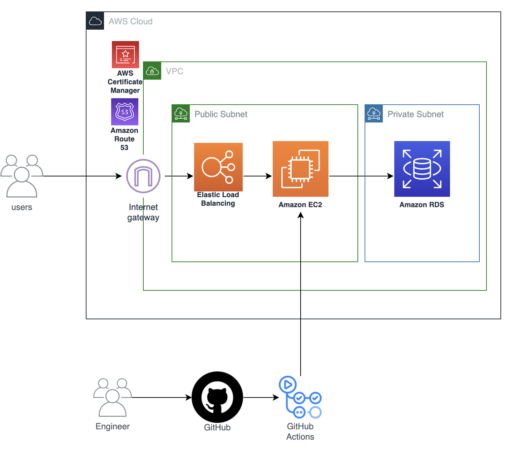

# prapre

デプロイ先URL

※誰でも利用可能にするため、認証機能と履歴機能は無しで公開しています。

[https://www.prapre.online](https://www.prapre.online)

### db 作成
ターミナルで以下実行
```
$ createdb prapredb
```
### backend 環境変数設定
.env　backend直下に作成
```
DB_URL=jdbc:postgresql://localhost/prapredb
DB_USER=[your db user name here]
DB_PASS=[your db user password here]
```

### frontend 環境変数設定
.env　frontend直下に作成
```
VITE_APK_KEY=[your amivoice api key here]
```

### AWSの構成図

